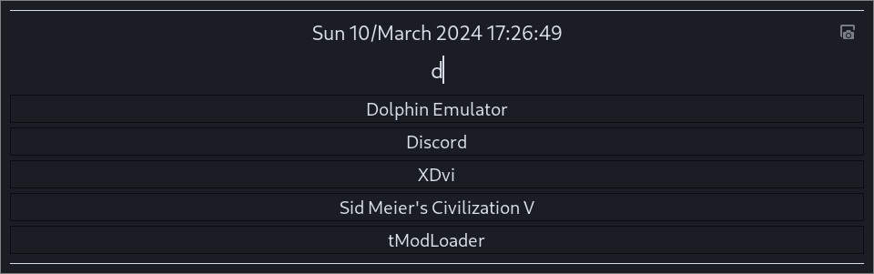

## Generic Launcher

A generic applications launcher. 
Supports css styling through symlink to css file created in `$XDG_CONFIG_HOME/generic_launcher/launcher.css`

Depends on `gtk4-layer-shell` (https://github.com/wmww/gtk4-layer-shell) and `inotifytools` (todo: make this dependency optional for hotswapping css)

Screenshot button depends on `grim`, `slurp`

## Installation

install dependencies, then change directory into repo root and run
`cargo build --release`

Set up shortcuts for your compositor. For Hyprland I use: 

`$launcher = <repo folder>/target/debug/generic_launcher`
`bind = SUPER, SUPER_L, exec, $launcher`

todo:
	- launch actions
	- refocus opened applications (hyprland integration)
	- allow fullscreening apps (hyprland integration)
	- scroll up
	- refactor

The default CSS used in the screenshot uses the default system theme, in this case [Andromeda](https://www.gnome-look.org/p/2039961)

## Attributions

Thank you to the gnome project http://www.gnome.org for icons (Adwaita)
These are packaged to avoid dependencies.

