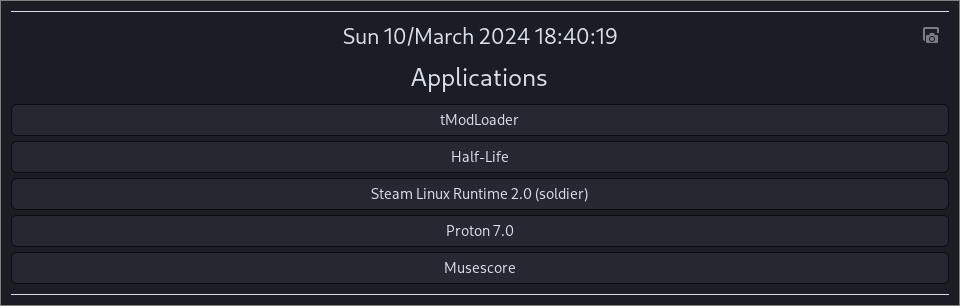

## Generic Launcher

A generic applications launcher. 
Supports css styling.
Copy the css file or create a symbolic link to `$XDG_CONFIG_HOME/generic_launcher/launcher.css`

Depends on `inotifytools` (todo: make this dependency optional for hotswapping css)

Screenshot button depends on `grim`, `slurp`

todo:
	- launch actions
	- refocus opened applications (hyprland integration)
	- allow fullscreening apps (hyprland integration)
	- scroll up
	- refactor

## Attributions

Thank you to the gnome project http://www.gnome.org for icons (Adwaita)
These are packaged to avoid dependencies.

